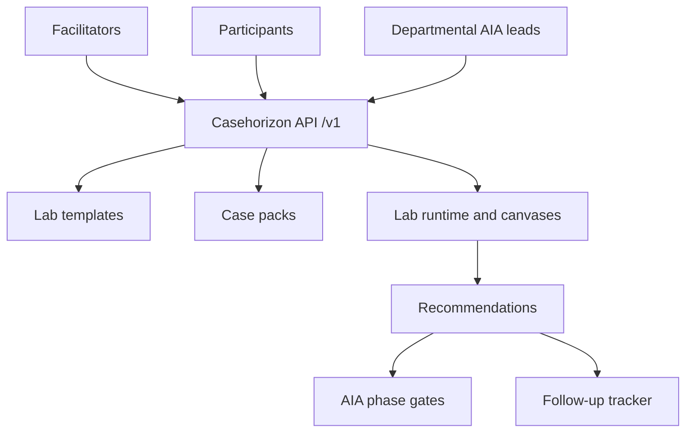

# Casehorizon

**Source:** `ai-in-gov/ai-future-policy-labs-ottawa/`
**Domain:** `ai-gov`
**One-liner:** Casehorizon is a structured AI futures policy-lab platform that walks emerging public-service leaders through real domain case studies — housing screening, justice research tools, classroom attention AI, immigration triage, hiring screens — and produces ranked recommendations bound to Algorithmic Impact Assessment gates.
**Wedge:** CIFAR / Brookfield-style policy innovation teams and federal academies training the next cadre of policy leaders — starting with Immigration, Refugees and Citizenship Canada triage use cases and Treasury Board Secretariat Directive on Automated Decision-Making alignment.
**Positioning:** An operating product for the AI Futures Policy Lab methodology, not a national strategy document. The Ottawa lab (CIFAR and Brookfield Institute, November 2018) showed that emerging policy leaders learn fastest from concrete applications (Naborly, ROSS, Nestor, Ideal, IRCC-style sorting) plus canvases that force impacted parties, jurisdictional effects, and top-three recommendations — while TBS develops Algorithmic Impact Assessment and the Directive on Autonomous/Automated Decision-Making. Casehorizon productises that lab loop.

## Market research synthesis

### Thesis from source

CIFAR (lead of the $125M Pan-Canadian AI Strategy) and the Brookfield Institute ran a series of AI Futures Policy Labs to build capacity among emerging policy leaders, give them a line of sight into AI myths versus capabilities, and contribute to early government responses. The Ottawa session convened 28 participants across five domains: housing (tenant risk scoring), justice (NLP legal research), education (attention analytics in online lectures), immigration (sorting applications into simple vs complex streams to ease backlog), and hiring (resume/chatbot/assessment screening). Facilitators used futures games, an AI 101 briefing (NRC), Michael Karlin’s TBS briefing on procedural fairness and the emerging Algorithmic Impact Assessment / Directive on Autonomous Decision-Making, and Brent Barron’s landscape of Pan-Canadian strategy, SCALE.AI, Montréal Declaration, GDPR, US AI in Government Act, and peer strategies.

Participants produced domain recommendations that repeatedly converged on oversight, rights alignment, explainability, open data / community access, and education for professions. Housing urged public consultations and an algorithmic intelligence auditor function; justice urged legal-aid access to tools and bias hackathons; education urged principles, adoption funds, and a non-profit data trust; immigration urged independent oversight with phase-gate implementation, human-rights alignment, and use of the TBS Directive; hiring urged an arms-length research institute, explainability frameworks, and open-source transparency. Feedback valued real-life cases and recommendation synthesis, and asked for more cross-group interaction.

The product thesis: policy capacity building fails when it stays abstract; it works when case packs, impact canvases, recommendation objects, and AIA phase gates are a reusable system of record for labs and for post-lab departmental follow-through.

### Buyer & economic model

- Primary buyer: policy innovation / academy lead at a federal central agency or at CIFAR-like strategy delivery bodies commissioning labs; secondary buyer is a department change lead (e.g. IRCC, justice, ESDC) running internal scenario exercises before AIA filing.
- Users: lab facilitators; emerging policy leader participants; TBS-aligned assurance advisors; domain SMEs; recommendation owners who must take actions after the lab.
- Budget owner / value metric: public-service learning and responsible-AI programme budgets. Value metric is share of lab recommendations that become tracked departmental actions with AIA phase-gate linkage, and participant competency lift on procedural fairness concepts.
- Competing status quo: one-off workshop slide decks; sticky-note photos with no follow-up; AIA forms filled without prior structured risk exploration; strategy landscape briefings disconnected from operational cases.

### Domain constraints

- Regulatory / trust / safety: procedural fairness and human rights in immigration and hiring; privacy and domestic safety in housing and education attention analytics; Directive on Automated Decision-Making and AIA obligations for federal systems.
- Data sensitivity: case packs must use public or synthetic descriptions of commercial systems; live personal data from IRCC or schools never enters the lab platform.
- Change-management realities: labs without post-event ownership become theatre; facilitators need reusable canvases; departments resist external “recommendations” unless they map to existing directive language.

## Business requirements

- BR-1: Every lab instance selects one or more domain case packs with a canonical description of the AI application, affected parties, and known policy tensions.
- BR-2: Participants complete structured canvases covering impacted groups (positive/negative), local/national/global effects, and existing policies touched — matching the Ottawa canvas design.
- BR-3: Each group must file a ranked top-N recommendation set with owners and intended policy levers before the lab can close.
- BR-4: Recommendations that imply federal automated decisioning must link to an Algorithmic Impact Assessment phase gate or explicitly record why AIA does not apply.
- BR-5: Cross-domain synthesis is a first-class output so labs can satisfy the Ottawa feedback demand for inter-group learning.
- BR-6: Case packs distinguish commercial examples from government operational systems and never require live personal data.
- BR-7: Facilitation agendas, speaker modules (AI 101, TBS briefing, landscape), and timing are versioned templates reusable across cities.
- BR-8: Post-lab actions inherit recommendation IDs with due dates; orphan recommendations appear in ageing reports.
- BR-9: Human-rights and procedural-fairness checkpoints are mandatory prompts for immigration, hiring, and justice domains.
- BR-10: Participant feedback on lab design is captured systematically to drive template iteration (as CIFAR/BII+E did between labs).
- BR-11: External publication of recommendations carries the lab disclaimer that outputs are participant exercises, not institutional positions — unless an owner formally adopts them.
- BR-12: Departmental instances can run closed labs with access control while still exporting anonymised pattern libraries upward to the academy.

## User stories

Canonical user stories live in sibling [USER_STORIES.md](USER_STORIES.md).

## System design

### Overview

Casehorizon manages lab templates, domain case packs, live lab instances, canvas responses, recommendation objects, cross-domain synthesis, and post-lab action tracking linked to AIA phase gates. It is a learning-and-assurance bridge: capacity building in, accountable follow-through out.

### Actors & boundaries

- Actors: facilitators; participants; departmental AIA leads; assurance advisors; academy administrators; optional public observers of anonymised pattern libraries.
- Trust boundary: educational case content only; no operational decisioning on real applicants. Links to AIA systems are references and status, not a bypass of TBS tools.
- Human-in-the-loop points: case-pack approval; lab close-out; recommendation adoption; AIA phase-gate acknowledgement; public release classification.

### Core capabilities

1. **Lab template management** — agendas, modules, versioning.
2. **Domain case packs** — housing, justice, education, immigration, hiring, extensible.
3. **Lab instance runtime** — cohorts, breakouts, timing.
4. **Impact canvases** — structured capture of parties, scales, policies.
5. **Recommendation engine** — ranked, owned, lever-tagged recommendations.
6. **AIA phase-gate linkage** — binding or explicit non-applicability.
7. **Cross-domain synthesis** — pattern extraction across breakouts.
8. **Post-lab action tracker** — due dates, ageing orphans.
9. **Feedback loop** — participant design feedback into templates.
10. **Publication controls** — exercise vs adopted status.

### Conceptual data

- Primary entities: LabTemplate, CasePack, LabInstance, ParticipantCohort, CanvasResponse, Recommendation, PolicyLever, AiaPhaseGate, SynthesisReport, FollowUpAction, FeedbackEntry, PublicationStatus.
- Critical events: lab opened; canvas submitted; recommendations ranked; lab closed; AIA gate linked; action adopted/aged; synthesis published.
- Retention / audit needs: educational records retained per public-service learning policy; adopted recommendations and AIA links retained for assurance audits; raw sticky-note equivalents retained as structured canvas data.

### Integrations (conceptual)

- Systems of record: Canada School of Public Service / academy LMS; TBS AIA tooling; departmental responsible-AI registers; CIFAR programme ops.
- Upstream signals: Directive on Automated Decision-Making updates; Montréal Declaration principles; commercial case developments for pack refresh.
- Downstream actions: AIA filings; departmental policy projects; public anonymised pattern libraries; curriculum updates.

### High-level architecture

### Success metrics

- Leading: share of labs closed with owned ranked recommendations; share of automation-related recommendations with AIA linkage or explicit waiver; participant feedback completion rate; cross-domain synthesis produced.
- Lagging: share of recommendations adopted into departmental actions within 180 days; reduction in orphan recommendations; measured participant confidence on procedural fairness; reuse rate of templates across cities.

## OpenAPI skeleton

Canonical HTTP surface lives in sibling [openapi.yaml](openapi.yaml). Summary:

- **Base path:** `/v1/...`
- **Auth:** `X-API-Key` for LMS/AIA connectors; Bearer JWT for facilitators and participants.
- **Resource groups:** Templates, CasePacks, Labs, Canvases, Recommendations, AiaGates, Actions.
