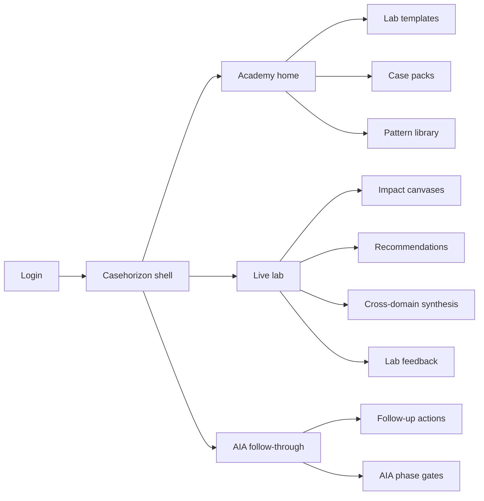
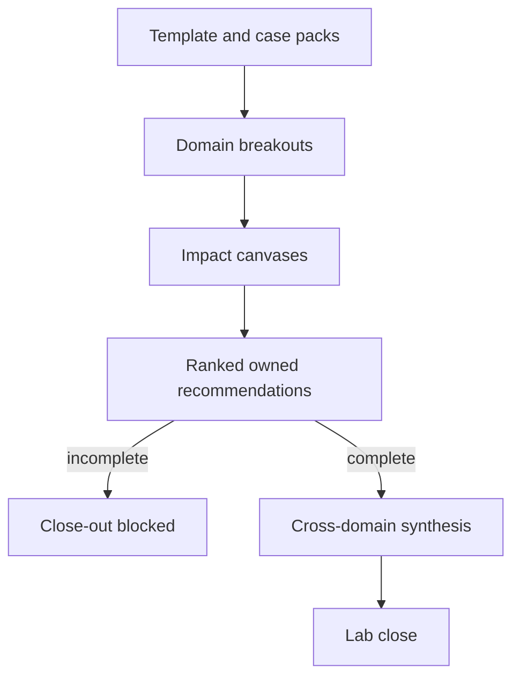

# Casehorizon — Web app

**Product:** [PRODUCT.md](./PRODUCT.md)
**Primary surface:** AI Futures Policy Lab console (facilitators + participant breakout workspaces)
**Secondary surfaces:** Departmental AIA follow-through board; anonymised pattern library (read-only academy export)
**Design thesis:** Casehorizon is a lab that refuses to die as sticky-note theatre — every session ends with ranked, owned recommendations bound to Algorithmic Impact Assessment phase gates (or an explicit non-applicability record). The UI metaphor is a policy atelier: case packs on one wall, impact canvases in the centre, recommendation dock on the other, with procedural-fairness checkpoints that immigration, hiring, and justice domains cannot skip. Visual language is Ottawa winter daylight — cool paper-white panels on slate-blue ground, maple-signal red only for close-out blockers and orphaned actions — so the space feels like a working seminar room, not a startup demo day. The Casehorizon wordmark sits as a quiet academy seal on every lab close-out and AIA-linked action.

## UX research synthesis

### Category peers (best-in-class)

- **Miro / Mural (structured government workshop templates):** Facilitation timing and breakout boards. Steal: reusable canvas structure and timer discipline; reject unstructured sticky sprawl without forced ranking/ownership.
- **Canada TBS Algorithmic Impact Assessment portal (conceptual UX):** Phase gates and Directive language. Steal: AIA linkage as a first-class field on automation recommendations; reject “ethics checkbox” disconnected from lab output.
- **CIFAR / Brookfield policy lab programmes (facilitation kits):** Real commercial cases (housing, justice, education, immigration, hiring). Steal: concrete case packs over abstract AI 101-only days; reject live personal data in exercises.
- **Notion / Airtable programme trackers used by public-sector academies:** Post-event action ageing. Steal: orphan recommendation reports; reject workshop photos as the system of record.

### Patterns to adopt / reject

- **Adopt:** Versioned lab templates; domain case packs with tensions named; canvases for impacted parties / scale / policies; ranked top-N with owners and levers; AIA gate or explicit waiver; cross-domain synthesis; post-lab ageing; exercise vs adopted publication states; procedural-fairness mandatory prompts.
- **Reject:** Closing labs on applause; recommendations without owners; AIA claimed complete without evidence; live IRCC/school data; purple “AI policy copilot” drafting Directive text as authority; vanity participant counts as success.

### Trust, density, and workflow constraints from PRODUCT.md

No live personal data in case packs (BR-6). Labs cannot close without ranked owned recommendations (BR-3). Automation-implying recs must link AIA or record why not (BR-4). Publications default to participant-exercise disclaimer until formal adoption (BR-11). Closed departmental labs may still export anonymised patterns upward (BR-12). Human-rights checkpoints mandatory for immigration, hiring, justice (BR-9).

## Information architecture

### Nav model

### Roles → default home

| Role | Default home | Why |
|------|--------------|-----|
| Lab facilitator / academy lead | Academy home — upcoming labs | Instantiate Ottawa-style agendas (BR-7) |
| Emerging policy leader participant | Live lab — assigned case pack | Canvas + fairness prompts (BR-2, BR-9) |
| Departmental AIA / responsible-AI lead | AIA follow-through board | Bind foresight to assurance (BR-4, BR-8) |
| Assurance advisor | Gates + adoption queue | Reject false AIA completion |
| Domain SME | Case pack reviewer | Keep tensions accurate (BR-1) |
| Platform admin | Packs + publication controls | No live PII; disclaimer enforcement (BR-6, BR-11) |

### Cross-links to OpenAPI resources

| Nav area | OpenAPI tags / resources |
|----------|---------------------------|
| Agendas / modules | Templates |
| Housing, justice, education, immigration, hiring | CasePacks |
| Lab instances / cohorts | Labs |
| Impact canvases | Canvases |
| Ranked owned recommendations | Recommendations |
| Directive phase gates | AiaGates |
| Post-lab tracker | Actions |

## Screen inventory

### Academy home

- **Purpose:** Schedule labs, reuse templates, and see orphan-action ageing across cohorts.
- **Entry:** Facilitator/academy login.
- **Layout regions:** Brand + programme switcher; upcoming labs; template versions; orphan recommendation ageing chart; feedback iteration queue.
- **Primary actions:** Create lab instance; clone Ottawa template; open pattern library.
- **Empty / loading / error:** Empty = “load CIFAR/Brookfield-style starter template.”
- **BR / story ties:** BR-7, BR-8, BR-10.

### Lab template editor

- **Purpose:** Version agendas, AI 101 / TBS / landscape modules, and timing.
- **Entry:** Templates nav.
- **Layout regions:** Module timeline; speaker slots; canvas checkpoints; close-out rules (recommendations required).
- **Primary actions:** Publish template version; compare city iterations.
- **Empty / loading / error:** Missing close-out rule = cannot publish.
- **BR / story ties:** BR-7, BR-10.

### Case pack library

- **Purpose:** Canonical AI application descriptions, affected parties, policy tensions — commercial vs government labelled; no live PII.
- **Entry:** Packs nav; lab setup.
- **Layout regions:** Domain grid (five Ottawa domains + extensions); pack detail; tension list; data-safety attestation.
- **Primary actions:** Approve pack; attach to lab; refresh commercial example with disclaimer.
- **Empty / loading / error:** Pack without safety attestation = blocked.
- **BR / story ties:** BR-1, BR-6.

### Live lab runtime

- **Purpose:** Run cohort breakouts with timers and facilitation controls.
- **Entry:** Lab start.
- **Layout regions:** Agenda clock; breakout rooms by domain; facilitator broadcast; close-out readiness meter (recs ranked?).
- **Primary actions:** Open breakout; nudge incomplete canvases; attempt close-out.
- **Empty / loading / error:** Close-out blocked until BR-3 satisfied.
- **BR / story ties:** BR-3, BR-7.
- **Mobile notes:** Participant canvas OK on tablet; facilitator controls desktop-preferred.

### Impact canvas

- **Purpose:** Structured capture of impacted groups (+/−), local/national/global effects, policies touched.
- **Entry:** Participant breakout.
- **Layout regions:** Three canvas panels matching Ottawa design; fairness checkpoint drawer for immigration/hiring/justice; save state.
- **Primary actions:** Complete panels; flag fairness response; submit canvas.
- **Empty / loading / error:** Efficiency-only answers trigger fairness prompt before submit (BR-9).
- **BR / story ties:** BR-2, BR-9.

### Recommendation dock

- **Purpose:** Ranked top-N with owners and policy levers before lab can close.
- **Entry:** After canvases; facilitator close-out.
- **Layout regions:** Ranked list; owner assignment; lever tags; AIA applicability toggle; Directive language mapper.
- **Primary actions:** Rank; assign owner; link AIA gate or record non-applicability; lock for close-out.
- **Empty / loading / error:** Unowned or unranked = coral blocker on close.
- **BR / story ties:** BR-3, BR-4.

### Cross-domain synthesis

- **Purpose:** Inter-group learning patterns (oversight, rights, explainability, open data, education).
- **Entry:** Post-breakout plenary.
- **Layout regions:** Pattern clusters across domains; quote-safe excerpts; export to cohort.
- **Primary actions:** Generate synthesis; pin to pattern library (anonymised); share in plenary.
- **Empty / loading / error:** Fewer than two domains submitted = synthesis disabled.
- **BR / story ties:** BR-5.

### AIA phase-gate linkage

- **Purpose:** Bind automation-related recommendations to AIA phase gates or explicit waiver.
- **Entry:** From recommendation; departmental board.
- **Layout regions:** Gate status; evidence of filing; advisor reject path if adoption claims completion without proof.
- **Primary actions:** Link gate; record non-applicability; reject false completion.
- **Empty / loading / error:** Automation rec without link/waiver = cannot adopt.
- **BR / story ties:** BR-4.

### Follow-up action tracker

- **Purpose:** Post-lab actions inherit recommendation IDs with due dates; orphans age visibly.
- **Entry:** Departmental board default.
- **Layout regions:** Action table; ageing report; adoption vs exercise status; ADM export.
- **Primary actions:** Adopt; set due date; close; escalate orphan.
- **Empty / loading / error:** Empty after lab = warning “theatre risk.”
- **BR / story ties:** BR-8, BR-11.

### Publication and pattern library

- **Purpose:** External outputs carry exercise disclaimer unless formally adopted; anonymised patterns upward.
- **Entry:** Academy patterns; publish flow.
- **Layout regions:** Publication status badge; disclaimer preview; anonymisation check; departmental closed-lab export.
- **Primary actions:** Publish as exercise; mark adopted; export anonymised patterns.
- **Empty / loading / error:** Missing disclaimer = block public release.
- **BR / story ties:** BR-11, BR-12.

### Lab feedback

- **Purpose:** Systematic design feedback to iterate templates between cities.
- **Entry:** Lab end; academy queue.
- **Layout regions:** Feedback form; theme tags; template change proposals.
- **Primary actions:** Submit feedback; accept into next template version.
- **Empty / loading / error:** Low completion = facilitator prompt.
- **BR / story ties:** BR-10.

## Key flows

1. **Run Ottawa-style lab** — pick template + case packs → canvases → ranked owned recs → synthesis → close; failure: close blocked without ownership (BR-3).

2. **AIA binding** — automation recommendation → link phase gate or waiver → advisor validates evidence on adoption (BR-4).

3. **Orphan ageing** — lab ends → actions due → ageing report to ADM if unowned (BR-8).

4. **Publish with disclaimer** — draft output → exercise badge default → formal adoption clears institutional position claim (BR-11).

5. **Closed departmental lab export** — run private cohort → anonymise patterns → push to academy library (BR-12).

## Design system

### Tokens (CSS variables)

- `--color-ink: #1A2332` — text on light panels
- `--color-paper: #F4F7FA` — canvas panels (cool paper, not cream-terracotta)
- `--color-slate-950: #121821` — shell ground
- `--color-slate-800: #243041` — chrome
- `--color-signal: #C8102E` — close-out blockers / orphans (maple signal, sparingly)
- `--color-lake: #2F6F8F` — primary actions / synthesis
- `--color-amber: #D4943A` — fairness checkpoint incomplete
- `--color-ok: #2F8F6B` — lab closed with gates linked
- `--color-brand: #4A6F8C` — Casehorizon wordmark
- `--font-display: "Libre Franklin", sans-serif` — lab titles
- `--font-body: "Source Serif 4", serif` — canvas reading text (seminar, not broadsheet columns)
- `--font-mono: "IBM Plex Mono", monospace` — recommendation and AIA ids
- `--space-1`…`--space-8`: 4px scale
- `--radius-sm: 4px`; `--radius-md: 10px` — atelier softness only on canvases
- `--motion-close: 200ms ease-out` — close-out stamp
- `--motion-orphan: 260ms ease-in-out` — ageing pulse
- `--motion-fairness: 180ms linear` — checkpoint reveal
- Atmosphere: soft north-light gradient and faint topological “policy contour” lines; no maple-leaf sticker clutter; no purple AI gradients.

### Typography & brand

- Sans for facilitation chrome; serif for case narrative and canvas prompts; mono for ids.
- Brand seal on close-out, AIA linkage, and published outputs.
- Login: brand hero; headline (“Rank it. Own it. Gate it.”); one CTA.

### Do / don’t

- **Do:** Block close without owned ranks; force fairness prompts; AIA or waiver; exercise disclaimer; anonymise pattern exports.
- **Don’t:** Purple AI glow; sticky-note photos as record; live personal data; fake AIA complete; dashboard-of-everything academy home.

### Accessibility & domain trust cues

- AA+ contrast on signal red; blockers include text.
- Live regions for close-out readiness and orphan ageing.
- Focus order: case → canvas → recommendations → AIA → actions.
- Published pages announce exercise vs adopted in plain language.

## Component patterns

- **CasePackCard** — domain, tensions, commercial vs government label, PII-safe attestation.
- **OttawaCanvas** — impacted parties / scales / policies panels.
- **FairnessCheckpoint** — mandatory prompts for immigration, hiring, justice.
- **RecommendationRankList** — top-N with owners and levers.
- **AiaGateLink** — phase gate or explicit non-applicability.
- **CloseOutMeter** — readiness to close lab.
- **OrphanAgeingReport** — unowned actions over time.
- **PublicationDisclaimerBadge** — exercise vs adopted.
- **SynthesisCluster** — cross-domain pattern map.

## Out of scope for v1 web

- Running real automated decisions on applicants; replacing TBS AIA system of record; public citizen consultation portal; LMS gradebook replacement; video-conferencing product (integrates, does not rebuild).
